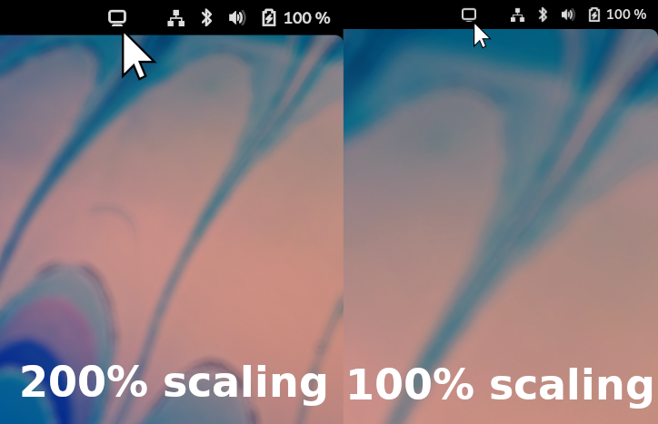

Simple Gnome extension that adds a toggle icon to the dash to change the display scaling of the primary monitor between 100% and 200%.

This extension requires python3 to be installed. This will hopefully change in the future.

For manual installation copy all files to `~/.local/share/gnome-shell/extensions/scaletoggle@t-vk.github.com`. Then reboot or log out and in again.

Note: In more recent versions of Gnome, this extension does not seem to be wokring anymore. Further investigation is required.
